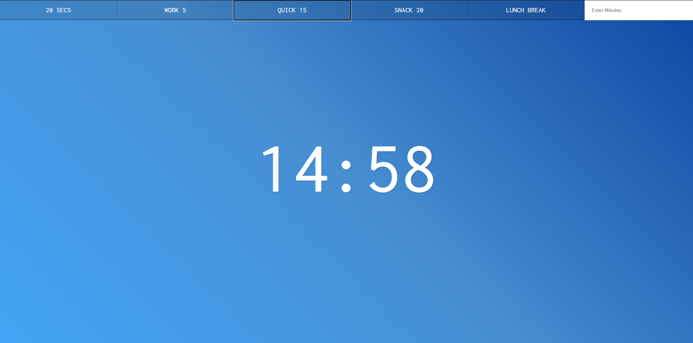

# Countdown App in Vanilla JS

To run this project locally:
<br>
<a href="https://moonlit-llama-2483f1.netlify.app/">🔗Click Demo</a>
<br>
Clone the repository:
   ```bash
   git clone https://github.com/therealilyas/countdown-js.git
  ```

